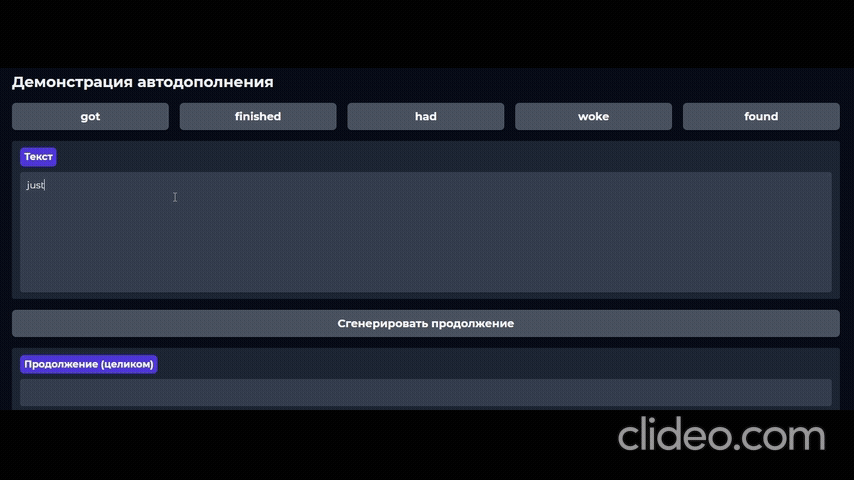

# Autocompletion RNN + distilgpt2 baseline



## Установка

**venv:**

```bash
python -m venv .venv

.venv\Scripts\activate или source .venv/bin/activate

pip install -U pip
pip install -r requirements.txt
```

## Данные

Данне доступны по ссылке [Скачать с Яндекс.Диска](https://disk.yandex.ru/d/E3v0ZPFNHSpMDg):
**`raw_dataset.csv`** — *одна строка = одно сообщение/текст*.

### Шаг 1. Предобработка (см. `solution.ipynb`, раздел “Шаг 1”)

* читаем `raw_dataset.csv` на шаге 1.1;
* базовая очистка (обрезка пробелов/контрольных символов; опционально фильтры по длине);
* разбиение на train/val/test;
* токенизация `distilgpt2` (добавляем `<PAD>`), результат — **списки ID токенов**;
* сохраняем в:

  ```
  data/train.json
  data/val.json
  data/test.json
  ```

  Каждый файл — `list[list[int]]`.

### Шаг 2. Обучение (см. `solution.ipynb`, раздел “Шаг 2”)

* модель: `src/model.py` → `RNNAutocompletion`;
* датасет: `src/dataset.py` → `NextTokenDataset` (режим скользящего окна `chunk_length=32`, `stride=32`);
* лоссы/метрики пишутся в TensorBoard;
* веса сохраняются в:

  ```
  exp/exp1/weights/best.pt
  exp/exp1/weights/last.pt
  ```
* логи: `exp/exp1/logs/` (формат TensorBoard).

Пример команды для TensorBoard:

```bash
tensorboard --logdir exp/exp1/logs
```

### Шаг 3. Оценка и сравнение (см. `solution.ipynb`, раздел “Шаг 3”)

Скрипт сравнивает RNN с `distilgpt2` при длинах контекста **1, 7, 21, 28** токенов на тестовой выборке:

* метрика **ROUGE-L**;
* печатает табличку для сравнения;
* сохраняет примеры в файл:

  ```
  samples_test.txt
  ```

  формат:

  ```
  {контекст} | {истинный}
  {контекст} | {предсказание}
  ```

## Структура проекта

```
src/
  dataset.py       # NextTokenDataset: строит пары (input_ids, labels), даёт .msgs для free-run валидации
  model.py         # RNNAutocompletion: языковая модель на основе LSTM
  utils.py         # дополнительные инструменты для генерации
data/
  train.json
  val.json
  test.json
exp/
  exp1/
    logs/          
    weights/       
solution.ipynb     # шаги 1–3: предобработка → обучение → сравнение
requirements.txt
```

### Что делает `NextTokenDataset`

* Берёт список токенов и режет на чанки длиной `chunk_length` со сдвигом `stride`.
* Возвращает:

  * `input_ids`: первые `chunk_length` токенов;
  * `labels`: те же токены, сдвинутые на 1 (задача next-token).
* Хранит `msgs` — оригинальные сообщения (для свободной генерации на валидации/тесте).

### Что делает `RNNAutocompletion`

* Простая языковая модель на RNN (`dim`, `num_layers`, `dropout` настраиваются).
* Метод `generate(input_ids, max_new_tokens)` — генерация (greedy).

### Что делает `utils.py`

* `build_pairs`: собирает пары (контекст ровно K токенов; «хвост»-референс до M токенов, обрезанный по EOS).
* `free_gen_rougeL`: генерирует предсказания моделью обученной моделью и считает ROUGE-L.
* `free_gen_rougeL_distilgpt2`: то же, но через `distilgpt2`.

## Результаты обучения (TensorBoard)

<p align="center">
  
</p>

**Что на графиках и как это читать:**
- **Acc/valid_last@1** и **Acc/valid_last@5** — это доля случаев, когда модель угадала следующий токен в последней позиции чанка: строго топ-1 и попадание в топ-5 соответственно. Обе метрики на валидации стабильно растут.
- **ROUGE-L (по K=1/7/21/28)** — качество свободной генерации хвоста при разных длинах контекста. Метрика тоже растёт и выходит на плато для всех K → модель научилась использовать контекст.
- **Loss (train/valid)** — падают и затем стабилизируются, кривые близко друг к другу. Признаков переобучения нет.
- **Perplexity/valid 89** — снизилась и устаканилась; для данной задачи и токенизации выглядит разумно.
- Видно, что после снижения метрик был участок дополнительного улучшения — это соответствует срабатыванию динамического планировщика LR: шаг уменьшил learning rate, и обучение продолжилось ещё немного, подтянув качество.

В сумме: метрики растут, лоссы падают, ROUGE-L укрепляется по всем K, переобучения не наблюдается — модель действительно сошлась и обучилась.